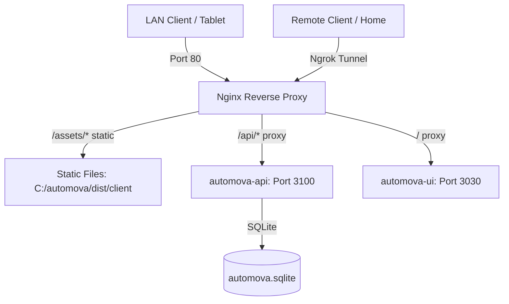

# AUTOMOVA Local LAN Server Migration & Deployment Documentation
This document serves as the single source of truth for the AUTOMOVA deployment on the local Windows 11 Factory PC. Use this as a reference for maintenance, troubleshooting, and future development.

---

## 1. System Architecture Overview
The local environment is designed to run completely inside the factory LAN while allowing remote access and process resiliency.



*   **Reverse Proxy**: **Nginx (Port 80)** serves as the gateway. It routes static asset requests directly from disk for maximum speed and proxies dynamic pages/API endpoints to their respective Node.js servers.
*   **Process Manager**: **PM2** manages and monitors the backend API and frontend UI processes.
*   **Database**: **SQLite (C:\automova\data\automova.sqlite)** stores all operational data locally.
*   **Remote Access**: **Ngrok** provides secure, password-protected tunnels to bypass ISP CGNAT.
*   **Process Resiliency**: **Windows Task Scheduler** runs the startup script automatically on boot.

---

## 2. Credentials & Server Info
*   **Local Server IP (LAN)**: `192.168.100.75` (Port 80)
*   **Local Administrator User**: `adminpabrik`
*   **Local Password**: `pabrik123`
*   **GitHub Repository**: `https://github.com/dr-iskandar/automova.git`
*   **Project Path**: `C:\automova`
*   **Nginx Path**: `C:\nginx`

---

## 3. What Has Been Done (Milestones Completed)

### ✓ Cross-Platform Code Migration
*   Integrated `cross-env` into the `package.json` build/start scripts to prevent Windows shell errors when declaring environment variables (specifically `WRANGLER_LOG_PATH`).

### ✓ Dependency & Asset Compiler Resolution
*   Handled resource locking issues caused by **360 Total Security** antivirus during `npm install` by placing folder exclusions/pausing the antivirus.
*   Successfully ran `npm install` and `npm run build` on the Windows host.

### ✓ Nginx Routing & 404 Asset Fixes
*   Configured `nginx.conf` with `try_files $uri @proxy` to resolve 404 errors for compiled assets (since the Cloudflare Workers adapter on port 3030 does not serve static files). Nginx now reads directly from `C:\automova\dist\client` and falls back to port 3030.

### ✓ Production Database Migration
*   Stopped VPS services safely to flush active SQLite WAL/SHM logs.
*   Downloaded the latest live database (`2.0 MB`) from VPS (`43.133.133.127:28`) and uploaded it directly to the Windows server, replacing the empty local database.

### ✓ Windows Task Scheduler & Boot Persistence
*   Created `C:\automova\start_automova.bat` to handle PM2 stop, start, and save sequences.
*   Registered a Task Scheduler task named **`StartAutomova`** running under the `adminpabrik` account with **Highest Privileges** at system startup (`ONSTART`).
*   Processes currently online:
    *   `automova-api` (Port 3100)
    *   `automova-ui` (Port 3030)

---

## 4. Ngrok Tunnel Management (How to Access From Home)
Since the Ngrok Free plan only permits **one concurrent tunnel**, you must toggle between **Remote CLI (SSH)** and **Remote Web Access (HTTP)**.

### Mode A: Remote Web Access (For testing/access from home)
1. **Otomatis via Task Scheduler (Rekomendasi)**:
   * Jalankan file script **`setup_ngrok_autostart.bat`** sebagai Administrator (`Klik Kanan` -> `Run as Administrator`) pada PC Server.
   * Ini akan mendaftarkan task **`StartNgrokWeb`** yang otomatis menjalankan `ngrok http 80` setiap kali komputer dinyalakan/booting di background.
2. **Manual via Command Line**:
   * Hentikan Ngrok yang sedang berjalan: `taskkill /f /im ngrok.exe`
   * Jalankan: `ngrok http 80`
3. Bagikan link publik yang muncul ke orang rumah.

### Mode B: Remote CLI Access (For coder/agent remote administration)
1. Stop the HTTP tunnel:
   ```cmd
   taskkill /f /im ngrok.exe
   ```
2. Start the SSH TCP tunnel:
   ```cmd
   ngrok tcp 22
   ```
3. Send the address (e.g., `0.tcp.ap.ngrok.io:24015`) to the agent/coder.

---

## 5. Next Steps & Recommended Actions

### 1. Database Backups
*   Create a simple backup batch file `C:\automova\backup_db.bat` that copies `automova.sqlite` to `C:\automova\data\backups` with a timestamp:
    ```cmd
    @echo off
    for /f "tokens=2-4 delims=/ " %%a in ('date /t') do (set mydate=%%c-%%a-%%b)
    copy "C:\automova\data\automova.sqlite" "C:\automova\data\backups\automova_%%mydate%%.sqlite"
    ```
*   Register this script in Windows Task Scheduler to run daily.

### 2. Claim Static Domain in Ngrok
*   To prevent the web link from changing every time Ngrok is restarted, log in to the Ngrok Dashboard, reserve a free static subdomain (e.g., `automova-factory.ngrok-free.app`), and run:
    ```cmd
    ngrok http 80 --domain=automova-factory.ngrok-free.app
    ```
